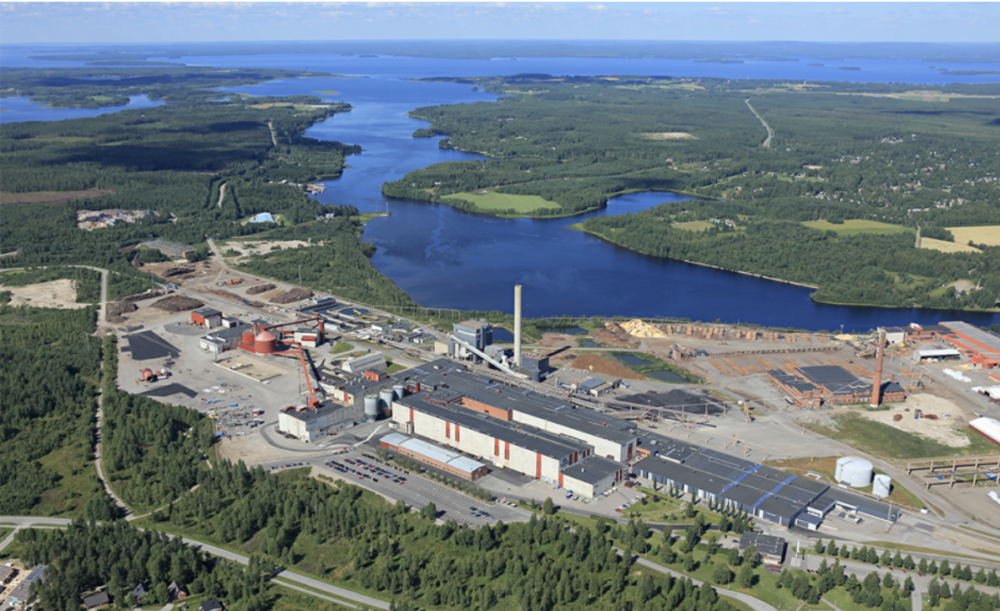
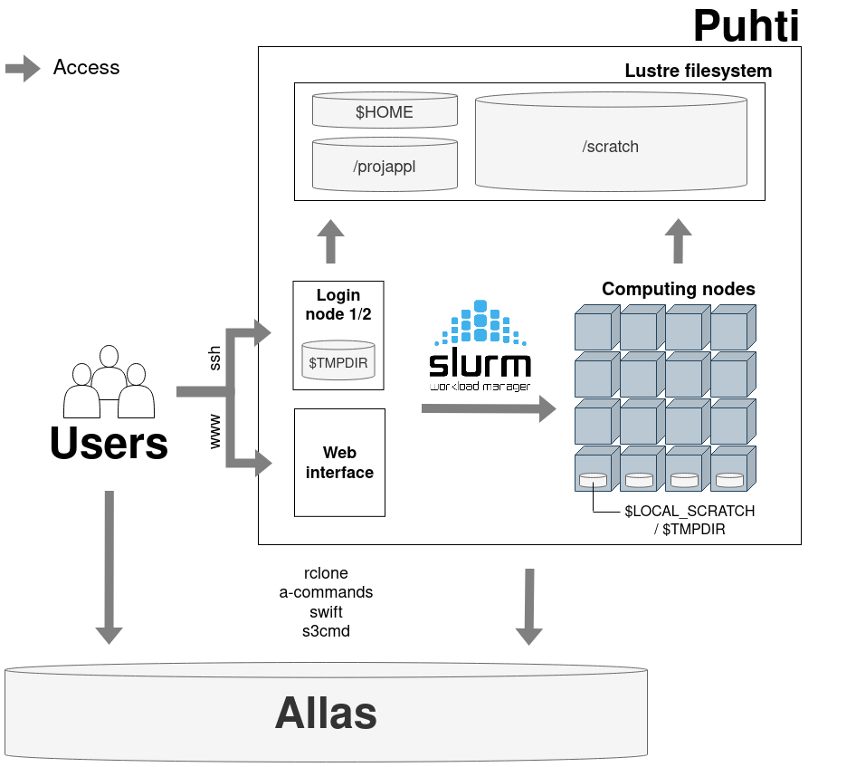
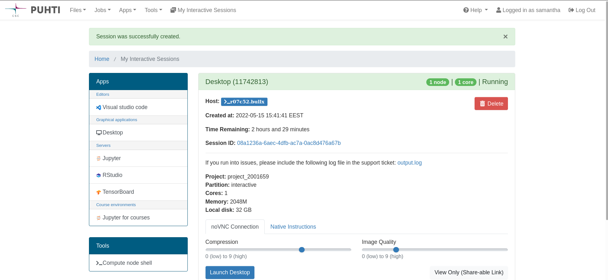

# Using supercomputer Puhti for spatial data processing with Python {.title}

<div class="column">

</div>
<div class="column">
<small>
All material (C) 2022-2023 by CSC -IT Center for Science Ltd.
This work is licensed under a **Creative Commons Attribution-ShareAlike** 4.0
Unported License, [http://creativecommons.org/licenses/by-sa/4.0/](http://creativecommons.org/licenses/by-sa/4.0/)
</small>
</div>

# CSC - IT center for science

<div class="column">

* Non-profit company producing IT services for research and higher education
* Owned by ministry of education and culture (70%) and higher education institutions (30%)
* Headquaters in Keilaniemi, Espoo
* Side offices and supercomputers in Kajaani

</div>

<div class="column">

<p align="center">
  

</p>

</div>

# In the end you hopefully know more about...

<br><br>

* What kind of services are offered by CSC and why you might want to use them
* The supercomputer and how to start using it with Python
* How and when to use Allas object storage
* How to get started with your own Pyhton scripts on Puhti

# Why use CSC services?

* CSC specialist support
* “Outsource” heavy/specialized computations
* **Free of charge** for open science Finnish universities and research institutes

# CSC services

<br></br>
<div class="column">
**Compute & Analyze**

* <p style="font-size:40px;"> Webservices, virtual machines in the cloud: `cPouta / ePouta / Rahti` </p>
* <p style="font-size:40px;"> Heavy computations on the supercomputer: `Puhti / Mahti / LUMI` </p>
* <p style="font-size:40px;"> Teaching and collaborating: `CSC Notebooks` </p>

</div>
<div class="column">
**Store, Share & Publish Data**

* <p style="font-size:40px;"> Project lifetime data storage: `Allas` </p>
* <p style="font-size:40px;"> Share and publish data: `Fairdata`</p>
* <p style="font-size:40px;"> Share and publish geospatial data: `Paituli`</p>
</div>

<br>

<div><p style="font-size:40px;">Working with privacy related data: `Sensitive Data (SD) services`</p></div>

<div><p style="font-size:40px;">&rarr; [CSC service catalog](https://research.csc.fi/en/service-catalog)</p></div>


# MyCSC

* Manage your account
* Manage your projects/services
* Estimate billing units
* Change password
* ...

[`https://my.csc.fi`](https://my.csc.fi)

# Skills needed

<p align="center">
"`You can’t learn everything you need all at once.
Instead, continually learn and know when to ask for help.`"
<br> <small>- Aalto Scientific Computing</small>
</p>

* Using CSC computing resources: basic Linux commands
* Supercomputer
    * serial & 'embarassingly parallel' tasks: basic Linux commands, basic HPC terminology 
    * parallel work: High Performance Computing (HPC), scientific coding
* Virtual Machines (VM): Linux administration 
<p>&rarr; [CSC quick reference](https://docs.csc.fi/img/csc-quick-reference/csc-quick-reference.pdf)</p>

# Training

* ['CSC computing environment' self-study course](https://ssl.eventilla.com/csccompenvselflearn)
* ['Research data management' self-study course](https://ssl.eventilla.com/event/v8B6B)
* [CodeRefinery workshop materials](https://coderefinery.org/lessons/core/)
* [CSC geoinformatics training materials](https://research.csc.fi/gis-learning-materials)

<br><br>
<p>&rarr; Follow our [training calendar](https://www.csc.fi/en/training#training-calendar)</p>

# How we can help

* 'Z is not working as expected'
* 'My code gives error Y'
* 'Can A be installed to Puhti?'
* 'Any advice how to do X?'
* Training/example wishes

<br><br>
<p>&rarr; servicedesk@csc.fi</p>
<p>&rarr; [Weekly user support coffe break](https://ssl.eventilla.com/usersupportcoffee)</p>
<p>&rarr; [Speed up your request](https://docs.csc.fi/support/support-howto/)</p>


# Supercomputer

Main differences to own computer:
<br><br>

* Not faster, but more *
* For speed up: runnings many experiments at same time, parallelism
* Memory and CPU(/GPU) availability (application needs to make use of this!)
* Non-interactive for heavy computations
* Resource knowledge

# Why use CSC supercomputer Puhti?

When own computer is not enough:
<br><br>

* Resource needs (time (> 2 hours), memory (> 8 GB), storage (> 50GB), GPU)
* Prebuilt environments, applications available
* Run many experiments at same time
* Data availability
* Collaboration possibility

# Possibilities

* Use more memory/CPU/GPU than your own computer has available <br><br>

<p>&rarr; analyse large files, Machine learning model training </p><br>

* Speed up so called *embarrassingly parallel* analyses (many identical, but separate tasks) <br><br>

<p>&rarr; doing same thing to multiple map tiles/ data chunks </p>

# Applications on Puhti

<div class="column">
* CloudCompare
* FORCE 
* GDAL/OGR
* GRASS GIS
* LasTools
* MatLab 
* OpenDroneMap
* Orfeo Toolbox
* PCL
* PDAL
</div>

<div class="column">
* Python geospatial packages: geoconda
* QGIS
* R geospatial packages: r-env
* SagaGIS
* SNAP, Sen2cor, sen2mosaic
* WhiteboxTools
* Zonation
* Deep learning: pytorch, tensorflow

 Something missing?
      Ask us :)
      servicedesk@csc.fi
</div>

# Modules

Applications in Puhti are provided in modules. Use

<br>

`module load <modulename>`

<br>

before every application use to make application available.

Check [`https://docs.csc.fi/apps`](https://docs.csc.fi/apps) for module names, versions and possible CSC specifics.

# Data available on CSC supercomputer Puhti

<div class="column">

* Large commonly used geospatial datasets with open license
* Removes transfer bottleneck
* Located at: `/appl/data/geo/`
* All Puhti users have read access

</div>
<div class="column">

* ~13 TB of datasets available:
  * Paituli data 
  * SYKE open datasets
  * LUKE Multi-source national forest inventory
  * NLS Virtual rasters for DEMs
  * Sentinel and Landsat mosaics

</div>

<br>

<div>
[List of spatial data in computing environment](https://docs.csc.fi/data/datasets/spatial-data-in-csc-computing-env/)
</div>

# Puhti basics

<p align="center">
  
</p>

# Directories

<br>

* $HOME – most important (small) files, personal access only
* $PROJAPPL – project specific / your installations/ shared binaries
* $SCRATCH – main working area, can be used to share with project members

# Jobs and queueing 

* **Batch** jobs
	* resource request
	* computing step(s)
* Queue for resource management system to grant resources
* All heavy computing must be done via batch jobs!

<br>
<p>&rarr;Always run small scale tests first interactively (not on login node!) or via small batch job</p>

# Example sbatch script

- A batch job is a shell script (bash) that consists of two parts:
   - A resource request flagged with `#SBATCH` and the actual computing step(s)

```text
#!/bin/bash
#SBATCH --job-name=print_hostname     # Defines the job name shown in the queue.
#SBATCH --time=00:01:00               # Defines the max time the job can run.
#SBATCH --partition=test              # Defines the queue in which to run the job.
#SBATCH --ntasks=1                    # Defines the number of tasks.
#SBATCH --cpus-per-task=1             # Number of cores is ntasks * cpus-per-task.
#SBATCH --account=project_20001234    # Defines the billing project. Mandatory field.

srun echo "Hello $USER! You are on node $HOSTNAME"
```
<br>
<p>&rarr; File `test_sbatch.sh` </p> 
<p>&rarr; Submit for computation with `sbatch test_sbatch.sh` </p>

# If a job fails..

1. Did the job run out of memory/time?
2. Were all resources specified correctly?
3. Immediate fail or fail after some time? 
4. Check the error output (#SBATCH --error=$SLURM_JOB_ID.err)
5. Check software specific logs

# Puhti web interface

<p>&rarr; Check your data, testing, code development, file management, quotas, graphical applications </p>

[`puhti.csc.fi`](https://puhti.csc.fi)

<p align="center">
  
</p>

# Runnings things at the same time

* within batch script 
<p>&rarr;  GNU parallel, array jobs, other workflow tools </p>
* within python script
<p>&rarr; dask, multiprocessing, joblib, ... </p>


# Allas

* "Object storage"
* Up to 200TB for free
* Connected to CSC services and own computer
* Project lifetime data storage
* Sharing data within your CSC project
* Looks similar, but is not a file system
<br><br>
<p>&rarr;Buckets - Objects</p>

# Own project hints ans suggestions

* Keep scripts under version control (e.g. git(hub))
* On Puhti: 
    * Scripts and data in `/scratch/project_200xxxx/your_groupname` 
    * Puhti webinterface / `scp` for data transfer: own computer - Puhti
    * `wget` for data transfer:  internet - Puhti 
    * No hardcoded filepaths such as `/my/home/dir/file.txt` in Python script
    * Package availability: `module load geoconda` and `list-packages` ([adding Python packages for your own usage](https://docs.csc.fi/apps/python/#installing-python-packages-to-existing-modules))

On project organization: [CodeRefinery lesson - Reproducible research](https://coderefinery.github.io/reproducible-research/organizing-projects/)<br>
[CodeRefinery lesson - Modular code development](https://coderefinery.github.io/modular-type-along/instructor-guide/)


# Take-home Message

* Manage your CSC services via our CSC customer portal at [MyCSC](https://my.csc.fi/)
* Resources are free for open science research (academic use)
* Participate in [CSC trainings](https://www.csc.fi/en/training), [read materials](https://github.com/csc-training/geocomputing) orgithub [checkout tutorials](https://docs.csc.fi/support/tutorials/) 
* Take advantage of CSC docs pages, e.g. [Puhti batch job system documentation](https://docs.csc.fi/computing/running/getting-started/)
* Contact our helpdesk for support and guidance: `servicedesk@csc.fi`

# Want to work with us?

Open temporary position in geoinformatics team with possibility for thesis work.

Topics:

* Python, dask
* HPC
* Workflows for spatial data processing

Contact `giscoord@csc.fi` if interested
